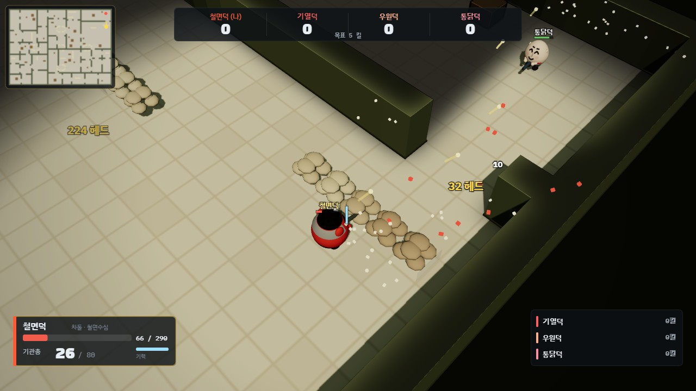
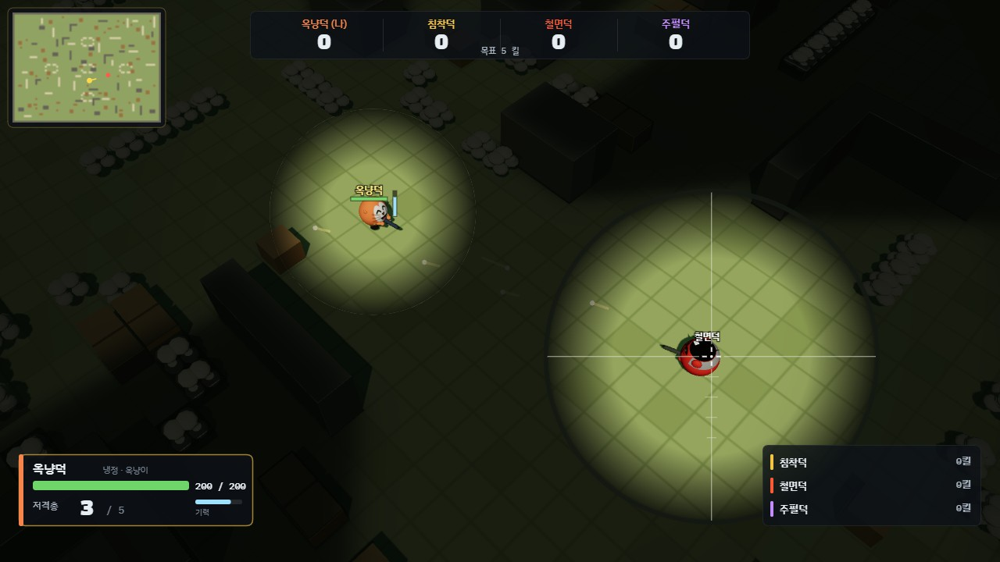
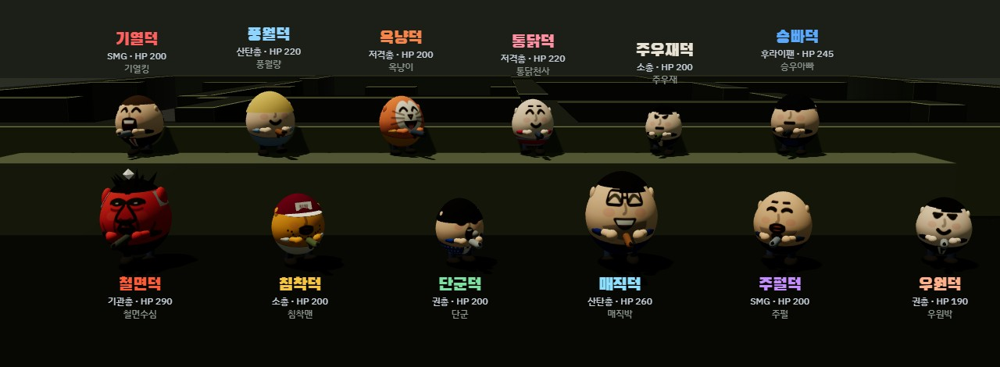
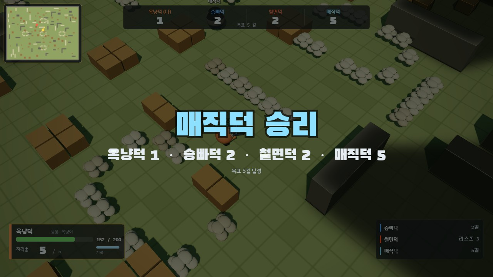

# 게시판·커뮤니티에 올릴 공지글 모음

> 회색 상자를 통째로 복사해 붙여 넣습니다.
> 상자 안에는 마크다운(`**`·`#`)을 쓰지 않습니다. 이모지가 글머리 기호 노릇을 합니다. 제목과 주소는 맨 위와 맨 아래에 둡니다.
> 처음 하는 사람에게는 [플레이 가이드](플레이-가이드.md)를 같이 보내면 됩니다.
> 최종 갱신 2026-09-06 (v1.3 기준, 수치·캐릭터 확정).

---

## 0. 같이 올릴 스크린샷

> 글 상자에는 이미지를 못 넣으니, 아래 4장을 글에 **첨부**로 올립니다.
> 파일은 `docs/img/` 에 있습니다. 순서는 이대로가 무난합니다.

**① 전투 — 시야 제한 · 모래주머니 엄폐 · HUD**



> 캡션 예: `벽 뒤는 안 보입니다. 모래주머니에 붙으면 내 총알만 넘어갑니다`

**② 저격 조준경 — 우클릭하면 멀리 보입니다**



> 캡션 예: `저격총은 우클릭으로 조준경을 켜야 맞습니다. 내 주변도 같이 보여서 붙는 적도 알아챌 수 있습니다`

**③ 캐릭터 12명**



> 캡션 예: `배도라지 12명, 전원 무기와 특기가 다릅니다`

**④ 결과 화면**



> 캡션 예: `목표 킬을 먼저 채우면 끝. 5킬부터 50킬까지 고를 수 있습니다`

---

## 1. 출시 공지 (전체 소개)

```
🦆 배도라지 덕 — 배도라지 크루 12명이 총을 들었습니다

▶ https://goormigrm.github.io/bedorage-duck/

설치 없음 · 가입 없음 · 주소만 열면 됩니다 · PC 권장, 모바일은 가로 화면

━━━━━━━━━━━━━━━━━━━━━━━━

📌 이런 게임입니다

🎮 비스듬히 내려다보는 3D 쿼터뷰 슈터입니다. 덕코프(Escape from Duckov) 손맛을 2~4인 대전으로 압축했습니다
👀 시야가 제한됩니다. 벽 뒤나 멀리 있는 적은 화면에 아예 안 보입니다. 모퉁이를 돌 때가 제일 무섭습니다
🛡 모래주머니 뒤에 붙으면 내 총알은 넘어가고 상대 총알은 막힙니다. 계속 맞으면 부서지니 터지기 전에 옮기세요
🎯 헤드샷은 확률이 아니라 조준입니다. 조준선이 상대 한가운데를 정확히 지나야 머리(피해 2배)입니다
💨 Space 로 구르면 그동안은 총알을 맞지 않습니다. 기력을 씁니다
💀 죽어서 기다리는 동안 Tab 을 누르면 캐릭터를 바꿔서 나올 수 있습니다. 상대에 맞춰 갈아타세요
💊 누굴 쓰러뜨리면 그 자리에 힐팩이 떨어집니다. 밟으면 체력이 35% 찹니다 (20초 뒤 사라집니다)
🎧 총성·발소리가 보이는 방향에서 들립니다. 헤드폰을 끼면 안 보이는 적이 어디 있는지 압니다
📜 끝난 판은 로비 "최근 전적" 에 남습니다. 복사해서 게시판에 자랑하셔도 됩니다
🗺 맵은 스튜디오(실내) · 마당(야외) · 주차장(기둥) 3종. 구조물은 매 판 새로 생성되고, 사람이 늘면 최대 4배까지 넓어집니다

━━━━━━━━━━━━━━━━━━━━━━━━

📌 모드

🤖 혼자 하기 — 봇 1~3명과 대결. 쉬움 / 보통 / 어려움. 봇 3명이면 2v2 팀전도 됩니다
👥 방 대전 — 최대 4명. 개인전 또는 2v2 팀전. 목표 킬은 5~50 중에 고릅니다
🔗 방을 만들면 방 목록에 바로 뜹니다. 친구는 "참가"만 누르면 됩니다 (코드나 링크로도 됩니다)
🌐 서버가 없습니다. 브라우저끼리 직접 연결됩니다. 그래서 공짜이고, 그래서 가끔 연결이 안 됩니다
🔌 하다가 끊겨도 45초 안에 다시 들어오면 하던 판을 이어서 합니다 (남은 사람들은 그동안 계속 합니다)
🔁 안 되면 한 명이 폰 핫스팟으로 바꿔서 다시 해 보세요

━━━━━━━━━━━━━━━━━━━━━━━━

📌 캐릭터 12명 (전원 무기와 특기가 다릅니다)

🔴 철면덕 (철면수심) — 기관총. 체력 290, 퍼부으면서 버팁니다
🧢 침착덕 (침착맨) — 소총. 반동 회복 2배로 연사가 안정적입니다
🎤 단군덕 (단군) — 권총. 안 보이는 적이 총을 쏘면 그 위치가 잠깐 보입니다
🥼 매직덕 (매직박) — 산탄총. 체력이 두껍고 3초 안 맞으면 스스로 회복합니다
🟣 주펄덕 (주펄) — SMG. 붙어 있는 상대에게 피해 20% 추가
🎭 우원덕 (우원박) — 권총. 구른 뒤에도 잠깐 무적입니다
🔁 기열덕 (기열킹) — SMG. 연속으로 맞힐수록 아파집니다 (최대 +54%)
🌬 풍월덕 (풍월량) — 산탄총. 구르기 쿨다운이 절반, 가장 빠르게 파고듭니다
🎯 옥냥덕 (옥냥이) — 저격총. 조준한 채로도 안 느려집니다
🍗 통닭덕 (통닭천사) — 저격총. 잡을 때마다 체력을 회복합니다
👠 주우재덕 (주우재) — 소총. 구르기 거리가 50% 깁니다
🍳 승빠덕 (승우아빠) — 후라이팬. 앞에서 오는 총알을 절반쯤 튕겨 내고 후려칩니다

━━━━━━━━━━━━━━━━━━━━━━━━

📌 알아두실 것

📱 폰·태블릿도 됩니다. 가로로 눕히면 이동 조이스틱과 사격 버튼이 생기고, 조준은 자동입니다
🎬 비공식 팬 프로젝트입니다. 비상업이고 광고·후원이 없습니다. 문제가 되면 바로 내립니다
🔒 계정도 저장도 없습니다. 입력하실 개인정보가 없습니다
🐛 이상한 점은 GitHub Issues 나 댓글로 알려 주세요

▶ https://goormigrm.github.io/bedorage-duck/

made by goormigrm
```

### 제목 후보

- `배도라지 크루 12명 넣고 총싸움 게임 만들었습니다 (브라우저에서 바로)`
- `배도라지 덕) 서버 없이 친구랑 최대 4인 대전 되는 덕코프풍 슈터`
- `덕코프 좋아하시면 한 판만 — 시야 제한 있는 2v2 팀전`

---

## 2. 짧은 버전 (채팅·패널·짤막 공지용)

```
🦆 배도라지 덕 — 배도라지 12명의 2~4인 쿼터뷰 슈터 (덕코프식 시야 제한)
🤖 혼자 하기(봇 1~3) · 👥 방 만들어 친구랑 개인전/2v2 · 설치도 서버도 없음
▶ https://goormigrm.github.io/bedorage-duck/
```

---

## 3. 방송 화면 자막·패널용 한 줄

```
🦆 배도라지 덕 — 방 목록에서 바로 참가 · goormigrm.github.io/bedorage-duck
```

```
🤖 지금 AI 어려움 ×3 vs 시청자 도전 받는 중 · 목표 10킬
```

---

## 4. 처음 하는 사람에게 (조작 안내)

```
🎮 조작은 이게 전부입니다

WASD 이동 · 마우스 조준 · 좌클릭 사격(꾹 누르면 연사)
우클릭 정조준 (저격총은 조준경이 켜집니다)
Space 구르기 — 구르는 동안은 총알을 맞지 않습니다
R 재장전 · Tab 캐릭터 교체 · N 소리 · Esc 메뉴

📱 폰이면 가로로 눕히세요
왼쪽 화면을 밀면 이동 · 오른쪽 화면을 누르고 있으면 사격 (사격 버튼도 같습니다)
조준은 자동입니다. 보이는 적 쪽으로 천천히 돌아갑니다
오른쪽 버튼으로 조준 / 구르기 / 재장전 / 교체

💡 세 가지만 기억하세요
1) 벽 뒤 적은 안 보입니다. 모퉁이를 조심하세요
2) 모래주머니 뒤에 붙어서 쏘면 일방적으로 때릴 수 있습니다
3) 헤드샷은 조준선이 상대 한가운데를 지나야 납니다
```

---

## 5. 시청자가 자주 묻는 것 (답변 문안)

```
Q. 설치해야 하나요
A. 아니요. 주소 열면 바로 됩니다. 크롬·엣지·파이어폭스 최신 버전이면 됩니다.

Q. 친구랑 어떻게 하나요
A. 한 명이 "방 만들기" 로 모드(개인전/2v2)와 목표 킬을 정합니다. 방이 목록에 뜨니까
   친구들은 "참가" 를 누르면 됩니다(코드나 링크로도 됩니다). 최대 4명, 모두 준비하면 시작입니다.

Q. 연결이 안 돼요
A. 서버 없이 컴퓨터끼리 직접 연결되는 방식이라 회사망·학교망·일부 공유기에서 막힐 수 있습니다.
   한 명이 폰 핫스팟으로 바꾸거나, 모두 집 와이파이면 대부분 됩니다.

Q. 렉이 있어요
A. 참가자 중 가장 느린 회선에 맞춰 돌아갑니다. 핑이 화면 오른쪽 위에 나옵니다.
   150ms 를 넘으면 체감이 됩니다. 브라우저 탭을 뒤로 보내면 화면이 멈추니 앞에 두세요.

Q. 적이 왜 안 보여요
A. 시야가 제한됩니다. 벽 뒤나 멀리 있는 적은 안 보입니다. 총소리와 총알은 보입니다.

Q. 저격총이 안 맞아요
A. 우클릭으로 조준경을 켜야 맞습니다. 그냥 쏘면 크게 빗나갑니다.
   조준경을 켜도 내 주변은 계속 보이니, 붙는 상대는 그쪽으로 확인하세요.

Q. 캐릭터 바꾸고 싶어요
A. 죽어서 기다리는 동안(또는 살아난 뒤 3초 안에) Tab 을 누르세요. 고르는 동안은 맞지 않습니다.

Q. 모바일 되나요
A. 됩니다. 가로로 눕히면 왼쪽에 이동 조이스틱, 오른쪽에 사격 버튼이 생깁니다.
   폰에서는 조준이 자동입니다(보이는 적 쪽으로 천천히 돌아갑니다). 그래서 이동과 사격만 하면 됩니다.
   세로로 들면 "가로로 돌려 주세요" 안내가 뜹니다. 정밀한 조준은 PC 가 더 낫습니다.

Q. 지난 판 기록 볼 수 있나요
A. 로비 아래 "최근 전적" 에 최근 50판이 남습니다. 닉네임·킬·데스까지 그대로 보입니다.
   같이 한 사람들은 모두 같은 내용을 갖게 됩니다. "복사" 를 누르면 게시판에 붙여 넣을 글이 됩니다.
   다만 서버가 없어서 전체 순위표는 없고, 기록은 그 브라우저에만 남습니다(지우면 사라집니다).

Q. 실제 멤버분들 허락 받은 건가요
A. 비공식 팬게임입니다. 수익화하지 않고, 실명 대신 패러디 이름을 씁니다.
   문제가 되면 바로 내립니다.

Q. 치트 막히나요
A. 서버가 없어서 못 막습니다. 친구끼리 하는 게임이라고 생각해 주세요.
```
